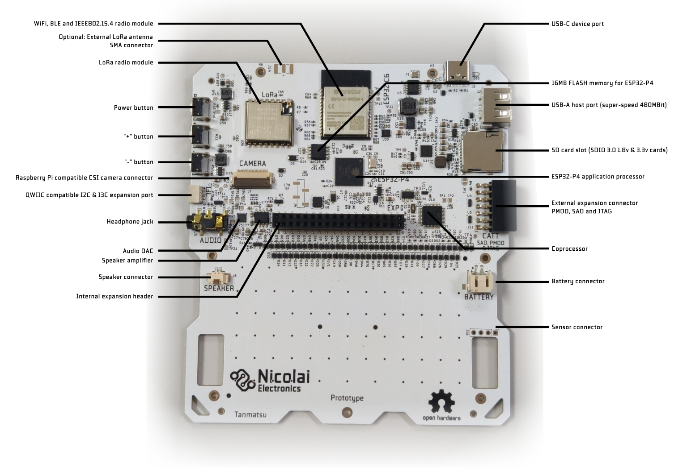

# Connectors

```{toctree}
:hidden:

internal-add-on-port/index
external-add-on-port/index
```



## Display connector

Hidden under the front panel a board to board connector connects the display to the main board. The display is pre-installed from the factory so normally you should not need to do anything with this connector.

The connector has the following signals:
 - Three MIPI DSI differential pairs (two for data and one for clock)
 - 3.3v power for the digital logic in the display
 - a 20mA at around 24v supply rail for the backlight LEDs

 The output current of the power regulator for the display backlight is controlled by the coprocessor with a PWM signal. You can set the backlight brightness by writing the display backlight brightness register exposed by the coprocessor on the internal I2C bus.

## Camera connector

The camera connector is used to connect a CSI camera module. It is pinout-compatible with the camera connector on the Raspberry Pi Zero and 5. Note that software support is limited to a subset of Raspberry Pi compatible camera module sensor chips such as OV5647.

The connector has the following signals:
 - Three MIPI CSI differential pairs (two for data and one for clock)
 - 3.3v power for the camera module
 - Enable signal (shared with the enable signal for the ESP32-C6 radio module)
 - LED control signal (shared with internal expansion port pin `E2`)

## USB-C device port

This port is used to charge the battery, to program and debug the ESP32-P4 and ESP32-C6 microcontrollers and to install apps and browse files from your computer.

It is connected to a USB hub chip which splits the USB port into three interfaces:

 - ESP32-P4 FS (12Mbit) USB port 1 (by default USB serial / JTAG)
 - ESP32-C6 USB serial / JTAG port
 - The internal expansion header

By default the ESP32-P4 exposes a USB serial/JTAG debugging peripheral via the USB-C port. This allows for flashing the ESP32-P4 even if no valid firmware is installed.

The firmware on the ESP32-P4 can swap this USB interface with a customizable USB interface, allowing for exposing other interfaces to the host PC. The launcher firmware includes a USB interface called `BadgeLink` which allows you to manage the device using a set of Python scripts and using WebUSB in the Chrome and Edge browsers.

To force the ESP32-P4 into a bootloader mode simply hold down the third (`-`) button on the right side of Tanmatsu down while powering on the device. An easy way to do this is to turn off Tanmatsu by pressing the power button until the device turns off, then press and hold the `-` while plugging in an USB cable into a PC. After plugging in the USB cable the device powers on, the screen will stay black.

## USB-A host port

This port can be used to connect a USB device. The 5 volt power output is is limited to 1A of current and protected against short circuits.

The USB-A port can be disabled and enabled by writing the relevant register of the coprocessor via the internal I2C bus. Note that the enable signal for the USB-A port is shared with the boot mode control pin of the ESP32-C6 radio module. When the ESP32-C6 radio gets enabled the USB-A port is forced to power on for a short time and when the ESP32-C6 radio gets put into bootloader mode the USB-A port is forced to power off for a short time.

## QWIIC & Stemma QT compatible I2C & I3C connector

This connector can be used to connect external I2C or I3C based accessories. Both Adafruit and Sparkfun make a variety of modules and cables which could be connected to this port.

## MMC card slot

Accepts micro SD memory cards including modern high speed SDIO 3.0 cards.

## Battery connector

Allows for connecting a single cell Lithium Polymer or Lithium Ion battery cell. Using a protected cell is mandatory. Unprotected cells could potentially be drained below their lowest allowable voltage, which causes damage to the battery. Current control, over voltage protection and proper constant voltage/current charge control are is built-in into the Tanmatsu main board.

## Sensor connector
Can be used to connect an optional sensor module.


## WiFi, BLE and IEEE802.15.4 radio module

The ESP32-C6 based module provides the board with access to WiFi, BLE and IEEE802.15.4 (mesh network) connectivity while also controlling the LoRa radio module via SPI.

By default the ESP32-C6 module runs a firmware called `ESP-Hosted-MCU`. This firmware allows the ESP32-P4 to make use of the WiFi and BLE functionality of the radio via the SDIO bus.

Adding support for the 802.15.4 mesh functionality of the ESP32-C6 module and the LoRa radio to the SDIO interface exposed by the `ESP-Hosted-MCU` firmware is planned.
