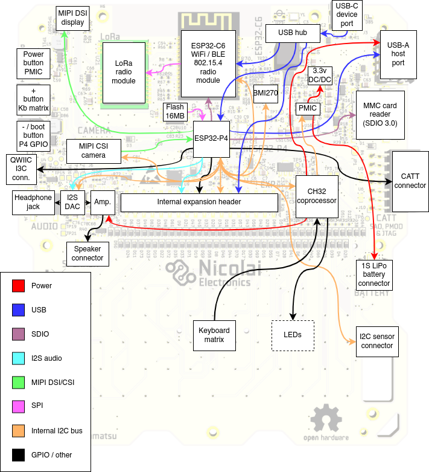
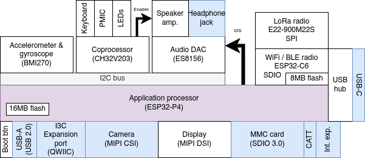

# Hardware

```{toctree}
:maxdepth: 2
specifications/index
connectors/index
i2c/index
case/index
keyboard/index
```

## Overview

This page describes all the hardware on the Tanmatsu main board, explaining how everything is connected.



The ESP32-P4 application processor is the star of the show, this is the processor that will run your applications.

It is directly connected to a lot of peripherals:

 - Quad SPI interface to a 16MB flash chip for storing firmware, apps and data
 - MIPI DSI and CSI interfaces to the display and camera ports
 - Multiple USB interfaces: as device to the USB-C port via the hub and as host to the USB-A port and the internal expansion header
 - Multiple SDIO interfaces: to the MMC card reader and the ESP32-C6 radio module
 - I2C/I3C interface: to the QWIIC port
 - I2C interface: to an I2C bus connecting all the peripherals on the main board to each other

### LEDs

Tanmatu has seven LEDs, six of which are addressable RGB LEDs located on the left and right sides of the screen. The seventh LED is located on the back of the board next to the USB-C connector.

The addressable LEDs are fully user controllable by writing the relevant registers of the coprocessor via the internal I2C bus. By default the coprocessor controls the LEDs automatically, this can of course be disabled.

When in automatic control mode the LEDs have the following meaning:

 - the "power" LED (top left) indicates the state of the power management subsystem. Blue indicates the device is running on battery power, orange means the battery is being charged via the USB-C connector, green means the battery is fully charged and red means the device is powered via USB but no battery is detected.
 - The "radio" LED (middle left) indicates the state of the ESP32-C6 radio module. When the radio module is disabled the LED is off, when the radio module is enabled and running normally the led is green and when the radio module is started in bootloader mode for flashing its firmware the led turns blue.
 - The "A" LED (middle right) indicates the state of the USB-A port power output. It is blue when the USB-A port is enabled and off when disabled.
 - The "C" LED (top right) turns red when the power button is pressed.

All other LEDs are currently not automatically controlled.

The "message" LED (bottom left) is meant to allow for indicating that an unread message is available to be read, for example after the radio module receives a message via WiFi, BLE, 802.15.4 mesh or LoRa while the ESP32-P4 application processor is running an app.

The "A", "B" and "C" LEDs are, aside from the above mentioned automatic control states for the "A" and "C" LEDs meant to show custom states defined by the running application.

The seventh LED is a single color red LED located on the back of the device. This LED is controlled by the power management chip and indicates the state of the power circuit.

It is:

 - Off when the battery is not charging
 - On when the battery is being charged
 - Blinks slowly when a fault has occurred (battery charging is automatically stopped)
 - Blinks rapidly when it attempts to charge the battery while no battery is attached

Expected behavior is that the LED blinks rapidly for a second when powering the board using the USB-C connector while there is no battery connected before turning off once the coprocessor starts up and instructs the power management chip to stop charging. If the LED continues to blink rapidly this could indicate that the coprocessor is not functioning.

#### LED orders and colors

The LED order is as follows:
* LED0: Power LED
* LED1: Radio
* LED2: Messages
* LED3: Power button LED
* LED4: A
* LED5: B

The color order is GRB. This means the following code will set the first LED to green:

```C
uint8_t led_data[] = {
    0xFF, 0x00, 0x00, 0x00, 0x00, 0x00, 0x00, 0x00, 0x00, 0x00, 0x00, 0x00, 0x00, 0x00, 0x00, 0x00, 0x00, 0x00,
};
bsp_led_write(led_data, sizeof(led_data));
```

The LED order is:
```
LED0-G, LED0-R, LED0-B, ..... , LED5-G, LED5-R, LED5-B,
```
For the array the prevouis example.

### Buttons

Tanmatsu has three buttons on the right side of the device. From top to bottom these buttons have the following functions:

 - Power button: hold for two seconds to power on or off the device
 - `+` button: currently unused, mapped to the `BSP_INPUT_NAVIGATION_KEY_VOLUME_UP` navigation event in the board support package (BSP) software component
 - `-` button: functions as bootloader trigger for the ESP32-P4 when pressed while powering on the device. Otherwise currently unused, mapped to the `BSP_INPUT_NAVIGATION_KEY_VOLUME_DOWN` navigation event in the board support package (BSP) software component

The `+` button as well as all the keys of the keyboard on the front of the device are wired up as a diode matrix and connected to the coprocessor. The `power` button is connected directly to the `PMIC` power management chip and the state of the power button can be read by the coprocessor. The state of the `power` button is presented to the application by the board support (BSP) component as the `BSP_INPUT_ACTION_TYPE_POWER_BUTTON` action event.

The `-` button is directly connected to `GPIO35` of the ESP32-P4 and is mapped to the `BSP_INPUT_NAVIGATION_KEY_VOLUME_DOWN` navigation event in the board support package (BSP) software component.

All the keyboard buttons are mapped to `INPUT_EVENT_TYPE_SCANCODE` events by the board support component (BSP), presenting a PC keyboard compatible scancode. In addition the BSP presents the keyboard buttons as `INPUT_EVENT_TYPE_NAVIGATION` and `INPUT_EVENT_TYPE_KEYBOARD` events too. Navigation keys trigger the navigation event while the letters and numbers trigger the keyboard event. The keyboard event contains the character on the keyboard button both as ASCII char and UTF-8 string, automatically incorporating the state of the modifier keys (`SHIFT` and `ALT GR`).



### Fasteners

Tanmatsu uses the following fasteners:

 - The front panel is attached using M2x5mm bolts
 - The back cover is attached using M2x15m bolts
 - The spacer contains M2 nuts for the bolts holding on the back cover to screw into

 The bolts that come with Tanmatsu use a 1.5mm hex style head.
