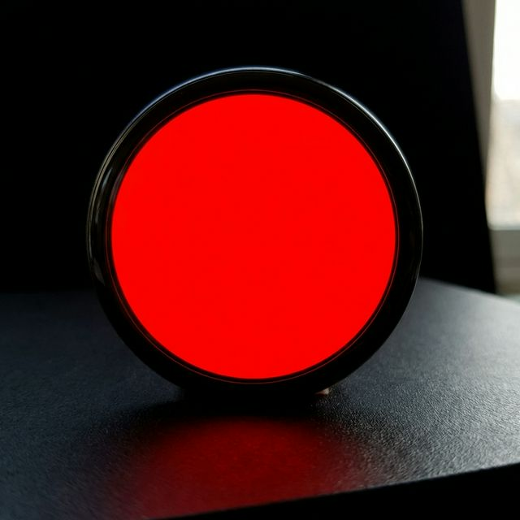
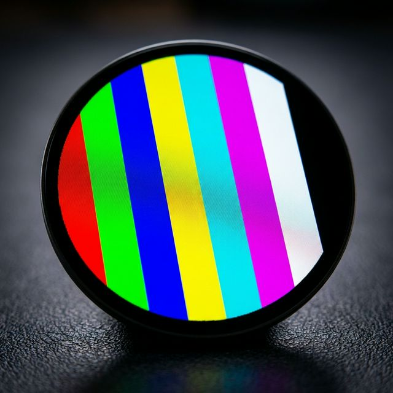
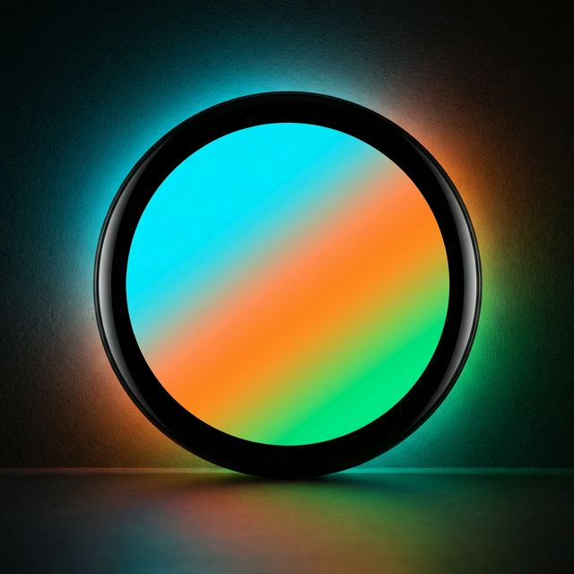

# Waveshare ESP32-S3-Knob — SH8601 AMOLED Display Fix 🎉

> **The correct Arduino driver for the Waveshare ESP32-S3-KNOB Touch LCD 1.8" — using the real SH8601 AMOLED chip via ESP-IDF QSPI.**

---

## 🖼️ Display Previews

| Full Red | Color Bars | Gradient |
|:---:|:---:|:---:|
|  |  |  |

---

## 🚨 The Problem Everyone Runs Into

If you Google this board, every guide tells you to use `ST77916` or similar SPI drivers. **They are all wrong.**

The display on the Waveshare ESP32-S3-Knob is an **SH8601 AMOLED** panel (`H0185Y040X`), and it requires a completely different approach:

| ❌ Wrong (what everyone tries) | ✅ Correct (what this repo does) |
|---|---|
| `Arduino_ST77916` / `Arduino_GFX` | `esp_lcd_sh8601` (ESP-IDF) |
| 8-bit SPI commands | **32-bit QSPI commands** |
| 20 MHz clock | **40 MHz clock** |
| Standard SPI init | 100+ vendor-specific init commands |

This was confirmed by **directly analyzing the original `WX-ESP32S3-KNOB_V1.2.bin` firmware** — specifically the `lcd_bsp.c` source in Waveshare's official Arduino demo package.

---

## ✅ What This Code Does

- Initializes the SH8601 AMOLED display correctly over QSPI at **40 MHz**
- Sends the **complete official init command sequence** (extracted from Waveshare's own firmware)
- Draws test patterns directly using `esp_lcd_panel_draw_bitmap()`
- **No LVGL required** — clean, minimal, easy to build on top of
- Rotary encoder cycles through 5 test patterns

### Test Patterns
| Key | Pattern |
|-----|---------|
| `0` | Full Red |
| `1` | Full Green |
| `2` | Full Blue |
| `3` | Color Bars (8 colors) |
| `4` | Cyan→Green Gradient |

---

## 🔧 Hardware

| Component | Detail |
|---|---|
| **Board** | Waveshare ESP32-S3-KNOB (`ESP32-S3-KNOB V1.1`) |
| **MCU** | ESP32-S3R8 (8MB PSRAM, 240MHz) |
| **Display** | 1.85" Round AMOLED — `H0185Y040X` |
| **Display Driver** | **SH8601** (QSPI) |
| **Interface** | Quad-SPI (4 data lines) |
| **Resolution** | 360 × 360 px |
| **Color depth** | RGB565 (16-bit) |

### Pin Configuration

```c
#define LCD_CS    14    // Chip Select
#define LCD_SCLK  13    // SPI Clock
#define LCD_D0    15    // QSPI Data 0 (MOSI)
#define LCD_D1    16    // QSPI Data 1 (MISO)
#define LCD_D2    17    // QSPI Data 2 (WP)
#define LCD_D3    18    // QSPI Data 3 (HD)
#define LCD_RST   21    // Reset
#define LCD_BL    47    // Backlight
#define POWER_EN   5    // Board power enable

#define ENC_A      9    // Encoder A
#define ENC_B     10    // Encoder B
#define ENC_SW     8    // Encoder Switch
```

---

## 📋 Arduino IDE Setup

1. **Board:** `ESP32S3 Dev Module`
2. **Flash Mode:** `QIO 80MHz`
3. **PSRAM:** `OPI PSRAM`
4. **Flash Size:** `16MB`
5. **Upload Speed:** `921600`
6. **Port:** The ESP32-S3 USB port (not the ESP32 port — the board has two chips!)

> Hold **BOOT** button during reset if the board doesn't enter download mode automatically.

---

## 📁 Files

```
Knob_SH8601_Display/
├── Knob_SH8601_Display.ino   ← Main Arduino sketch
├── esp_lcd_sh8601.c          ← SH8601 panel driver (from Waveshare official)
├── esp_lcd_sh8601.h          ← Driver header
└── images/                   ← Display preview screenshots
```

---

## 🔑 Key Technical Details

The SH8601 in QSPI mode requires **32-bit command frames** — this is why every standard SPI attempt fails with garbage or blank screen.

```c
// Critical settings — without these, NOTHING works:
.pclk_hz        = 40 * 1000 * 1000,   // 40 MHz
.lcd_cmd_bits   = 32,                  // 32-bit QSPI commands!
.lcd_param_bits = 8,
.flags.quad_mode = true,               // QSPI quad mode
```

The full `lcd_init_cmds[]` table (100+ commands) was extracted from Waveshare's official `lcd_bsp.c` source, which matches the binary firmware exactly.

---

## 📄 License

MIT — free to use, modify, and share.

---

## 🙏 Credits

- Original driver: [Espressif esp-bsp / esp_lcd](https://github.com/espressif/esp-bsp)
- Board: [Waveshare ESP32-S3-Knob-Touch-LCD-1.8](https://www.waveshare.com/wiki/ESP32-S3-Knob-Touch-LCD-1.8)
- Investigation & fix: Binary firmware analysis of `WX-ESP32S3-KNOB_V1.2.bin`
